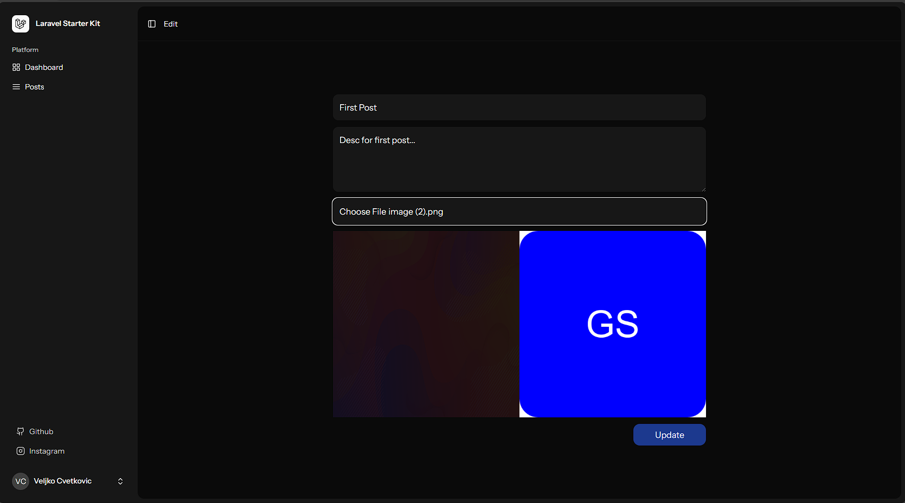

# Laravel 12 CRUD with Image Upload

## Overview
This project is a modern Laravel 12 CRUD application using React with TypeScript and Inertia.js
for a seamless full-stack experience. Inertia.js bridges the gap between Laravel and React,
eliminating the need for a REST API while maintaining the benefits of a single-page application.

## Technologies and Versions Used
#### PHP 8.3.10 
#### NodeJS 23.8.0
#### Laravel 12 
#### React 19 
#### Typescrypt 
#### Tailwind CSS
#### SQLite

## Features
- Laravel 12 as the backend
- React with TypeScript as the frontend
- Inertia.js for server-side rendering and seamless navigation
- Authentication using Laravel Breeze
- Fully functional CRUD operations
- Database migrations with seeders
- Responsive UI with Tailwind CSS (optional)
- Centralized state management with React Context or Redux (if applicable)
- Validation with Laravel Form Requests
- Flash messages for user feedback
- Role-based access control (if implemented)

## Requirements
Before installation, ensure you have the following:
- PHP >= 8.3
- Composer
- Node.js >= 22
- npm or yarn

## Installation

1. Clone repository
   
   ```bash
   git clone https://github.com/your-repo.git
   ```
2. Install depencies
   
   ```bash
   composer install
   ```
3. Install npm dependecies
   
   ```bash
   npm install
   ```
4. Start dev server
   
   ```bash
   composer run dev
   ```

# ScreenShots
Posts are protected so that only the user who owns the post can delete or edit it.

## Display all posts for that user


## Create post with image preview


## Show Post


## Edit Post

